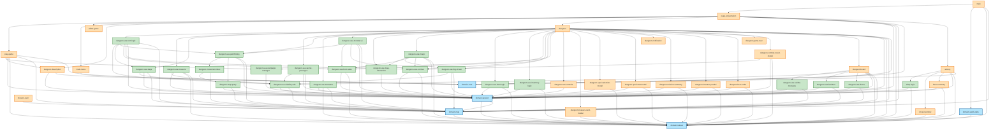

# ISL Dependency Graph

```mermaid
graph TD

    armory["armory"]
    domain-core["domain-core"]
    domain-map["domain-map"]
    domain-ruleset["domain-ruleset"]
    domain-session["domain-session"]
    domain-spells-data["domain-spells-data"]
    dungeon-board["dungeon-board"]
    dungeon-combat-result-modal["dungeon-combat-result-modal"]
    dungeon-description["dungeon-description"]
    dungeon-game-over["dungeon-game-over"]
    dungeon-hero-order["dungeon-hero-order"]
    dungeon-inventory-modal["dungeon-inventory-modal"]
    dungeon-map-query["dungeon-map-query"]
    dungeon-mission-summary["dungeon-mission-summary"]
    dungeon-movement-rules["dungeon-movement-rules"]
    dungeon-notification["dungeon-notification"]
    dungeon-spell-cast-modal["dungeon-spell-cast-modal"]
    dungeon-spell-selection-modal["dungeon-spell-selection-modal"]
    dungeon-treasure-card-modal["dungeon-treasure-card-modal"]
    dungeon-turn-controls["dungeon-turn-controls"]
    dungeon-use-campaign-manager["dungeon-use-campaign-manager"]
    dungeon-use-combat["dungeon-use-combat"]
    dungeon-use-doors["dungeon-use-doors"]
    dungeon-use-fog-of-war["dungeon-use-fog-of-war"]
    dungeon-use-furniture["dungeon-use-furniture"]
    dungeon-use-hero-stats["dungeon-use-hero-stats"]
    dungeon-use-inventory-logic["dungeon-use-inventory-logic"]
    dungeon-use-item-logic["dungeon-use-item-logic"]
    dungeon-use-magic["dungeon-use-magic"]
    dungeon-use-map-interaction["dungeon-use-map-interaction"]
    dungeon-use-monster-ai["dungeon-use-monster-ai"]
    dungeon-use-monsters["dungeon-use-monsters"]
    dungeon-use-pathfinding["dungeon-use-pathfinding"]
    dungeon-use-secret-passages["dungeon-use-secret-passages"]
    dungeon-use-traps["dungeon-use-traps"]
    dungeon-use-treasure["dungeon-use-treasure"]
    dungeon-use-turn-logic["dungeon-use-turn-logic"]
    dungeon-use-visibility-calc["dungeon-use-visibility-calc"]
    dungeon-use-visible-monsters["dungeon-use-visible-monsters"]
    dungeon["dungeon"]
    editor-game["editor-game"]
    hero-summary["hero-summary"]
    main-menu["main-menu"]
    main["main"]
    mission-card["mission-card"]
    page-presentation["page-presentation"]
    play-game["play-game"]
    shop-inventory["shop-inventory"]
    shop-logic["shop-logic"]

    armory --> domain-core
    armory --> domain-ruleset
    armory --> domain-session
    armory --> hero-summary
    armory --> shop-inventory
    armory --> shop-logic
    domain-map --> domain-ruleset
    domain-session --> domain-map
    domain-session --> domain-ruleset
    domain-spells-data --> domain-ruleset
    dungeon --> domain-core
    dungeon --> domain-map
    dungeon --> domain-ruleset
    dungeon --> domain-session
    dungeon --> dungeon-board
    dungeon --> dungeon-combat-result-modal
    dungeon --> dungeon-game-over
    dungeon --> dungeon-hero-order
    dungeon --> dungeon-inventory-modal
    dungeon --> dungeon-mission-summary
    dungeon --> dungeon-notification
    dungeon --> dungeon-spell-cast-modal
    dungeon --> dungeon-spell-selection-modal
    dungeon --> dungeon-treasure-card-modal
    dungeon --> dungeon-turn-controls
    dungeon --> dungeon-use-campaign-manager
    dungeon --> dungeon-use-combat
    dungeon --> dungeon-use-fog-of-war
    dungeon --> dungeon-use-hero-stats
    dungeon --> dungeon-use-inventory-logic
    dungeon --> dungeon-use-item-logic
    dungeon --> dungeon-use-magic
    dungeon --> dungeon-use-map-interaction
    dungeon --> dungeon-use-monster-ai
    dungeon --> dungeon-use-monsters
    dungeon --> dungeon-use-pathfinding
    dungeon --> dungeon-use-secret-passages
    dungeon --> dungeon-use-traps
    dungeon --> dungeon-use-treasure
    dungeon --> dungeon-use-turn-logic
    dungeon-board --> domain-core
    dungeon-board --> domain-map
    dungeon-board --> domain-ruleset
    dungeon-board --> domain-session
    dungeon-board --> dungeon-use-doors
    dungeon-board --> dungeon-use-furniture
    dungeon-board --> dungeon-use-visibility-calc
    dungeon-board --> dungeon-use-visible-monsters
    dungeon-combat-result-modal --> domain-ruleset
    dungeon-combat-result-modal --> domain-session
    dungeon-combat-result-modal --> dungeon-use-combat
    dungeon-description --> domain-core
    dungeon-description --> domain-session
    dungeon-hero-order --> domain-ruleset
    dungeon-hero-order --> domain-session
    dungeon-inventory-modal --> domain-ruleset
    dungeon-inventory-modal --> domain-session
    dungeon-map-query --> domain-map
    dungeon-map-query --> domain-session
    dungeon-mission-summary --> domain-ruleset
    dungeon-mission-summary --> domain-session
    dungeon-movement-rules --> domain-map
    dungeon-movement-rules --> dungeon-map-query
    dungeon-spell-cast-modal --> domain-ruleset
    dungeon-spell-cast-modal --> domain-session
    dungeon-spell-selection-modal --> domain-ruleset
    dungeon-spell-selection-modal --> domain-session
    dungeon-treasure-card-modal --> domain-ruleset
    dungeon-turn-controls --> domain-session
    dungeon-use-campaign-manager --> domain-session
    dungeon-use-combat --> domain-ruleset
    dungeon-use-combat --> domain-session
    dungeon-use-doors --> domain-map
    dungeon-use-doors --> domain-session
    dungeon-use-fog-of-war --> domain-map
    dungeon-use-fog-of-war --> domain-session
    dungeon-use-fog-of-war --> dungeon-use-visibility-calc
    dungeon-use-furniture --> domain-map
    dungeon-use-furniture --> domain-session
    dungeon-use-hero-stats --> domain-ruleset
    dungeon-use-hero-stats --> domain-session
    dungeon-use-inventory-logic --> domain-ruleset
    dungeon-use-inventory-logic --> domain-session
    dungeon-use-item-logic --> domain-ruleset
    dungeon-use-item-logic --> domain-session
    dungeon-use-magic --> domain-ruleset
    dungeon-use-magic --> domain-session
    dungeon-use-magic --> dungeon-use-combat
    dungeon-use-magic --> dungeon-use-fog-of-war
    dungeon-use-magic --> dungeon-use-hero-stats
    dungeon-use-magic --> dungeon-use-map-interaction
    dungeon-use-map-interaction --> domain-session
    dungeon-use-monster-ai --> domain-map
    dungeon-use-monster-ai --> domain-session
    dungeon-use-monster-ai --> dungeon-use-combat
    dungeon-use-monster-ai --> dungeon-use-hero-stats
    dungeon-use-monster-ai --> dungeon-use-pathfinding
    dungeon-use-monsters --> domain-map
    dungeon-use-monsters --> domain-ruleset
    dungeon-use-monsters --> domain-session
    dungeon-use-pathfinding --> domain-map
    dungeon-use-pathfinding --> domain-session
    dungeon-use-pathfinding --> dungeon-map-query
    dungeon-use-pathfinding --> dungeon-movement-rules
    dungeon-use-secret-passages --> domain-map
    dungeon-use-secret-passages --> domain-session
    dungeon-use-secret-passages --> dungeon-use-visibility-calc
    dungeon-use-traps --> domain-map
    dungeon-use-traps --> domain-session
    dungeon-use-traps --> dungeon-use-visibility-calc
    dungeon-use-treasure --> domain-map
    dungeon-use-treasure --> domain-ruleset
    dungeon-use-treasure --> domain-session
    dungeon-use-treasure --> dungeon-use-visibility-calc
    dungeon-use-turn-logic --> domain-map
    dungeon-use-turn-logic --> domain-session
    dungeon-use-turn-logic --> dungeon-use-combat
    dungeon-use-turn-logic --> dungeon-use-hero-stats
    dungeon-use-turn-logic --> dungeon-use-pathfinding
    dungeon-use-turn-logic --> dungeon-use-traps
    dungeon-use-turn-logic --> dungeon-use-visibility-calc
    dungeon-use-visibility-calc --> domain-map
    dungeon-use-visibility-calc --> domain-session
    dungeon-use-visible-monsters --> domain-map
    dungeon-use-visible-monsters --> domain-session
    hero-summary --> domain-ruleset
    hero-summary --> domain-session
    main --> domain-map
    main --> domain-ruleset
    main --> domain-spells-data
    main --> page-presentation
    main-menu --> domain-core
    mission-card --> domain-map
    page-presentation --> armory
    page-presentation --> domain-core
    page-presentation --> domain-map
    page-presentation --> domain-ruleset
    page-presentation --> domain-session
    page-presentation --> dungeon
    page-presentation --> dungeon-description
    page-presentation --> editor-game
    page-presentation --> main-menu
    page-presentation --> play-game
    play-game --> domain-core
    play-game --> domain-map
    play-game --> domain-ruleset
    play-game --> domain-session
    play-game --> dungeon-description
    play-game --> dungeon-use-campaign-manager
    shop-inventory --> domain-ruleset
    shop-logic --> domain-ruleset
    shop-logic --> domain-session

    classDef domain fill:#b3e5fc,stroke:#01579b,stroke-width:2px;
    classDef logic fill:#c8e6c9,stroke:#2e7d32,stroke-width:2px;
    classDef presentation fill:#ffe0b2,stroke:#ef6c00,stroke-width:2px;

    class domain-core,domain-map,domain-ruleset,domain-session,domain-spells-data domain
    class dungeon-map-query,dungeon-movement-rules,dungeon-use-campaign-manager,dungeon-use-combat,dungeon-use-doors,dungeon-use-fog-of-war,dungeon-use-furniture,dungeon-use-hero-stats,dungeon-use-inventory-logic,dungeon-use-item-logic,dungeon-use-magic,dungeon-use-map-interaction,dungeon-use-monster-ai,dungeon-use-monsters,dungeon-use-pathfinding,dungeon-use-secret-passages,dungeon-use-traps,dungeon-use-treasure,dungeon-use-turn-logic,dungeon-use-visibility-calc,dungeon-use-visible-monsters,shop-logic logic
    class armory,dungeon-board,dungeon-combat-result-modal,dungeon-description,dungeon-game-over,dungeon-hero-order,dungeon-inventory-modal,dungeon-mission-summary,dungeon-notification,dungeon-spell-cast-modal,dungeon-spell-selection-modal,dungeon-treasure-card-modal,dungeon-turn-controls,dungeon,editor-game,hero-summary,main-menu,main,mission-card,page-presentation,play-game,shop-inventory presentation
```
