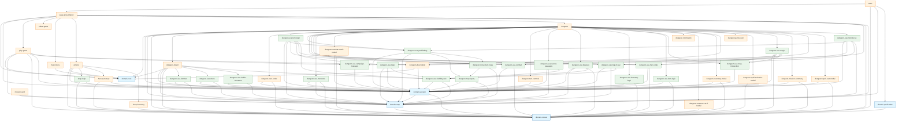

# ISL Dependency Graph

```mermaid
graph TD
    armory --> domain-core
    armory --> domain-ruleset
    armory --> domain-session
    armory --> shop-logic
    armory --> hero-summary
    armory --> shop-inventory
    domain-map --> domain-ruleset
    domain-session --> domain-map
    domain-session --> domain-ruleset
    domain-spells-data --> domain-ruleset
    dungeon-board --> domain-core
    dungeon-board --> domain-session
    dungeon-board --> domain-map
    dungeon-board --> domain-ruleset
    dungeon-board --> dungeon-use-furniture
    dungeon-board --> dungeon-use-doors
    dungeon-board --> dungeon-use-visible-monsters
    dungeon-board --> dungeon-use-visibility-calc
    dungeon-combat-result-modal --> dungeon-use-combat
    dungeon-combat-result-modal --> domain-session
    dungeon-combat-result-modal --> domain-ruleset
    dungeon-description --> domain-core
    dungeon-description --> domain-session
    dungeon-hero-order --> domain-session
    dungeon-hero-order --> domain-ruleset
    dungeon-inventory-modal --> domain-session
    dungeon-inventory-modal --> domain-ruleset
    dungeon-map-query --> domain-session
    dungeon-map-query --> domain-map
    dungeon-mission-summary --> domain-session
    dungeon-mission-summary --> domain-ruleset
    dungeon-movement-rules --> dungeon-map-query
    dungeon-movement-rules --> domain-map
    dungeon-spell-cast-modal --> domain-session
    dungeon-spell-cast-modal --> domain-ruleset
    dungeon-spell-selection-modal --> domain-ruleset
    dungeon-spell-selection-modal --> domain-session
    dungeon-treasure-card-modal --> domain-ruleset
    dungeon-turn-controls --> domain-session
    dungeon-use-campaign-manager --> domain-session
    dungeon-use-combat --> domain-session
    dungeon-use-combat --> domain-ruleset
    dungeon-use-doors --> domain-session
    dungeon-use-doors --> domain-map
    dungeon-use-fog-of-war --> domain-session
    dungeon-use-fog-of-war --> domain-map
    dungeon-use-fog-of-war --> dungeon-use-visibility-calc
    dungeon-use-furniture --> domain-session
    dungeon-use-furniture --> domain-map
    dungeon-use-hero-stats --> domain-session
    dungeon-use-hero-stats --> domain-ruleset
    dungeon-use-inventory-logic --> domain-session
    dungeon-use-inventory-logic --> domain-ruleset
    dungeon-use-item-logic --> domain-session
    dungeon-use-item-logic --> domain-ruleset
    dungeon-use-magic --> domain-session
    dungeon-use-magic --> domain-ruleset
    dungeon-use-magic --> dungeon-use-combat
    dungeon-use-magic --> dungeon-use-map-interaction
    dungeon-use-magic --> dungeon-use-fog-of-war
    dungeon-use-magic --> dungeon-use-hero-stats
    dungeon-use-map-interaction --> domain-session
    dungeon-use-monster-ai --> domain-session
    dungeon-use-monster-ai --> dungeon-use-pathfinding
    dungeon-use-monster-ai --> dungeon-use-combat
    dungeon-use-monster-ai --> dungeon-use-hero-stats
    dungeon-use-monster-ai --> domain-map
    dungeon-use-monsters --> domain-session
    dungeon-use-monsters --> domain-map
    dungeon-use-monsters --> domain-ruleset
    dungeon-use-pathfinding --> domain-session
    dungeon-use-pathfinding --> domain-map
    dungeon-use-pathfinding --> dungeon-map-query
    dungeon-use-pathfinding --> dungeon-movement-rules
    dungeon-use-secret-passages --> domain-session
    dungeon-use-secret-passages --> domain-map
    dungeon-use-secret-passages --> dungeon-use-visibility-calc
    dungeon-use-traps --> domain-map
    dungeon-use-traps --> domain-session
    dungeon-use-traps --> dungeon-use-visibility-calc
    dungeon-use-treasure --> domain-session
    dungeon-use-treasure --> domain-map
    dungeon-use-treasure --> dungeon-use-visibility-calc
    dungeon-use-treasure --> domain-ruleset
    dungeon-use-turn-logic --> domain-session
    dungeon-use-turn-logic --> domain-map
    dungeon-use-turn-logic --> dungeon-use-pathfinding
    dungeon-use-turn-logic --> dungeon-use-combat
    dungeon-use-turn-logic --> dungeon-use-traps
    dungeon-use-turn-logic --> dungeon-use-hero-stats
    dungeon-use-turn-logic --> dungeon-use-visibility-calc
    dungeon-use-visibility-calc --> domain-session
    dungeon-use-visibility-calc --> domain-map
    dungeon-use-visible-monsters --> domain-session
    dungeon-use-visible-monsters --> domain-map
    dungeon --> domain-core
    dungeon --> domain-session
    dungeon --> domain-map
    dungeon --> domain-ruleset
    dungeon --> dungeon-board
    dungeon --> dungeon-hero-order
    dungeon --> dungeon-use-turn-logic
    dungeon --> dungeon-use-pathfinding
    dungeon --> dungeon-use-combat
    dungeon --> dungeon-use-hero-stats
    dungeon --> dungeon-use-fog-of-war
    dungeon --> dungeon-use-monsters
    dungeon --> dungeon-combat-result-modal
    dungeon --> dungeon-turn-controls
    dungeon --> dungeon-use-secret-passages
    dungeon --> dungeon-use-treasure
    dungeon --> dungeon-use-inventory-logic
    dungeon --> dungeon-use-item-logic
    dungeon --> dungeon-use-map-interaction
    dungeon --> dungeon-notification
    dungeon --> dungeon-treasure-card-modal
    dungeon --> dungeon-inventory-modal
    dungeon --> dungeon-use-traps
    dungeon --> dungeon-game-over
    dungeon --> dungeon-spell-selection-modal
    dungeon --> dungeon-use-magic
    dungeon --> dungeon-mission-summary
    dungeon --> dungeon-use-campaign-manager
    dungeon --> dungeon-spell-cast-modal
    dungeon --> dungeon-use-monster-ai
    hero-summary --> domain-ruleset
    hero-summary --> domain-session
    main-menu --> domain-core
    main --> page-presentation
    main --> domain-ruleset
    main --> domain-map
    main --> domain-spells-data
    mission-card --> domain-map
    page-presentation --> domain-core
    page-presentation --> domain-session
    page-presentation --> play-game
    page-presentation --> editor-game
    page-presentation --> main-menu
    page-presentation --> armory
    page-presentation --> dungeon
    page-presentation --> dungeon-description
    page-presentation --> domain-ruleset
    page-presentation --> domain-map
    play-game --> domain-core
    play-game --> domain-map
    play-game --> domain-ruleset
    play-game --> domain-session
    play-game --> dungeon-description
    play-game --> dungeon-use-campaign-manager
    shop-inventory --> domain-ruleset
    shop-logic --> domain-ruleset
    shop-logic --> domain-session
    style armory fill:#fff3e0,stroke:#ef6c00
    style domain-core fill:#e1f5fe,stroke:#01579b
    style domain-map fill:#e1f5fe,stroke:#01579b
    style domain-ruleset fill:#e1f5fe,stroke:#01579b
    style domain-session fill:#e1f5fe,stroke:#01579b
    style domain-spells-data fill:#e1f5fe,stroke:#01579b
    style dungeon-board fill:#fff3e0,stroke:#ef6c00
    style dungeon-combat-result-modal fill:#fff3e0,stroke:#ef6c00
    style dungeon-description fill:#fff3e0,stroke:#ef6c00
    style dungeon-game-over fill:#fff3e0,stroke:#ef6c00
    style dungeon-hero-order fill:#fff3e0,stroke:#ef6c00
    style dungeon-inventory-modal fill:#fff3e0,stroke:#ef6c00
    style dungeon-map-query fill:#e8f5e9,stroke:#2e7d32
    style dungeon-mission-summary fill:#fff3e0,stroke:#ef6c00
    style dungeon-movement-rules fill:#e8f5e9,stroke:#2e7d32
    style dungeon-notification fill:#fff3e0,stroke:#ef6c00
    style dungeon-spell-cast-modal fill:#fff3e0,stroke:#ef6c00
    style dungeon-spell-selection-modal fill:#fff3e0,stroke:#ef6c00
    style dungeon-treasure-card-modal fill:#fff3e0,stroke:#ef6c00
    style dungeon-turn-controls fill:#fff3e0,stroke:#ef6c00
    style dungeon-use-campaign-manager fill:#e8f5e9,stroke:#2e7d32
    style dungeon-use-combat fill:#e8f5e9,stroke:#2e7d32
    style dungeon-use-doors fill:#e8f5e9,stroke:#2e7d32
    style dungeon-use-fog-of-war fill:#e8f5e9,stroke:#2e7d32
    style dungeon-use-furniture fill:#e8f5e9,stroke:#2e7d32
    style dungeon-use-hero-stats fill:#e8f5e9,stroke:#2e7d32
    style dungeon-use-inventory-logic fill:#e8f5e9,stroke:#2e7d32
    style dungeon-use-item-logic fill:#e8f5e9,stroke:#2e7d32
    style dungeon-use-magic fill:#e8f5e9,stroke:#2e7d32
    style dungeon-use-map-interaction fill:#e8f5e9,stroke:#2e7d32
    style dungeon-use-monster-ai fill:#e8f5e9,stroke:#2e7d32
    style dungeon-use-monsters fill:#e8f5e9,stroke:#2e7d32
    style dungeon-use-pathfinding fill:#e8f5e9,stroke:#2e7d32
    style dungeon-use-secret-passages fill:#e8f5e9,stroke:#2e7d32
    style dungeon-use-traps fill:#e8f5e9,stroke:#2e7d32
    style dungeon-use-treasure fill:#e8f5e9,stroke:#2e7d32
    style dungeon-use-turn-logic fill:#e8f5e9,stroke:#2e7d32
    style dungeon-use-visibility-calc fill:#e8f5e9,stroke:#2e7d32
    style dungeon-use-visible-monsters fill:#e8f5e9,stroke:#2e7d32
    style dungeon fill:#fff3e0,stroke:#ef6c00
    style editor-game fill:#fff3e0,stroke:#ef6c00
    style hero-summary fill:#fff3e0,stroke:#ef6c00
    style main-menu fill:#fff3e0,stroke:#ef6c00
    style main fill:#fff3e0,stroke:#ef6c00
    style mission-card fill:#fff3e0,stroke:#ef6c00
    style page-presentation fill:#fff3e0,stroke:#ef6c00
    style play-game fill:#fff3e0,stroke:#ef6c00
    style shop-inventory fill:#fff3e0,stroke:#ef6c00
    style shop-logic fill:#e8f5e9,stroke:#2e7d32
```
